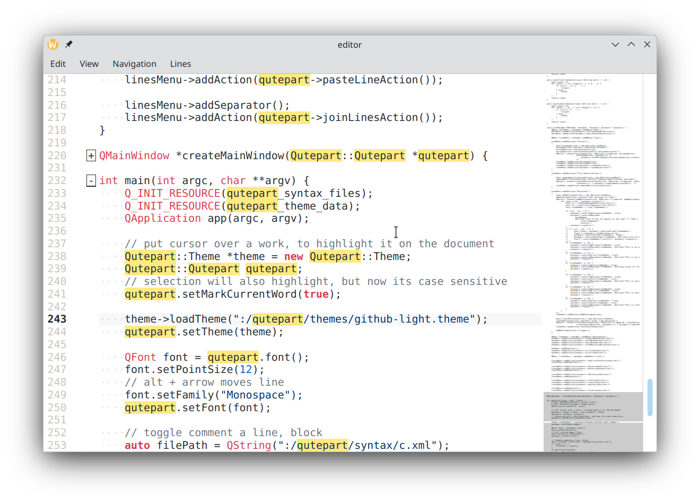

# Code editor widget for C++/Qt6

A code editor component for Qt6/C++. Easy to embed into your build system, packed with features.




[](https://github.com/diegoiast/qutepart-cpp/actions/workflows/build.yml)
[](https://github.com/diegoiast/qutepart-cpp/actions/workflows/clang-format.yml)
[](https://github.com/diegoiast/qutepart-cpp/actions/workflows/codespell.yml)
[](https://github.com/diegoiast/qutepart-cpp/actions/workflows/test.yml)

Does your application need a code editor component? Display
source code? This library is easy to integrate, easy to use.


```C++
    auto qutepart = new Qutepart::Qutepart(window);

    // optionally - set a theme
    auto theme = new Qutepart::Theme;
    theme->loadTheme(":/qutepart/themes/github-light.theme");
    qutepart.setTheme(theme);

    // It's a normal QPlainTextEditor - all known methods exist
    auto font = qutepart.font();
    font.setPointSize(12);
    font.setFamily("Monospace");
    qutepart.setFont(font);

    // Set an highlighter:
    auto langInfo = Qutepart::chooseLanguage(QString(), QString(), filePath);
    if (langInfo.isValid()) {
        qutepart->setHighlighter(langInfo.id);
        qutepart->setIndentAlgorithm(langInfo.indentAlg);
    }

    // Load text to the editor
    auto file = QFile(filePath);
    file.open(QIODevice::ReadOnly);
    auto data = file.readAll();
    auto text = QString::fromUtf8(data);
    qutepart->setPlainText(text);
```

## Features

All features are configurable

1. C++ native (needs a compiler with C++17 support).
2. Uses Qt6, no 3rd parties.
3. MIT licensed (can be used in closed source applications).
4. Derives QPlainTextEdit.
5. Follows dark themes.
6. Supported on Windows, Linux and OSX (probably BSD, untested - basically
   all platforms supported by Qt6). Including ARM64.
7. Good Unicode support: Supports BIDI (Arabic, Farsi, Hebrew), CJK and Hindu languages.
8. Integration is a simple as adding a few lines in your CMake file.
9. Uses Kate syntax highlighter, with more than 380 supported languages.
10. Theme support, again using the Kate themes.
11. Syntax/themes baked into the library (no need to install files on your app).
12. Undo/redo stack.
13. Insert/override text (defaults to insert, modify by pressing "Insert" key)
14. Copy/paste/cut/del (selection and current word/line).
15. Selection of current word: when the cursor is on a word,
    this word will be marked on all the document.
16. ... with a timeout. Only after 300 msec you move to a word,
    not to spam the CPU with useless tasks.
17. Matching brackets are highlighted side panel .
18. Auto brackets: when you press any of `[({` the corresponding closing
    bracket is added.
19. Mark the current line with a different background.
20. Line numbers side panel.
21. Current line in side panel is marked in bold.
22. ... and if you have some selection - that selection will be wrapped
    with the corresponding bracket.
23. Visible white-space: white-space is visible only at the end or beginning
    or a line, and in the middle - only if you have more than 2 spaces.
24. Smart end/home: if you have spaces at the end of a line, you can
    navigate to the logical end (ignoring the white-space) or the last
    character of a line.
25. Move line/selection up/down - without clipboard (alt+up, alt+down).
26. Duplicate selection, or current line (alt+d).
27. Can display margin (at line 80 by default).
28. Soft word wrap can be enabled at the margin (when you type after that line - text continues
    on the next line.
29. Shows indentation markers.
30. Multiple cursors (selection, copy, paste, moving).
31. Bookmarks (you can bookmark lines, and then move to them).
32. Join lines (control+j).
33. Change word/selection to UPPER CASE/lower case (or toggle).
34. Toggle comment (for supported languages) (control+]).
35. Text completion (from language keywords, and document).
36. When saving, honors original line ending (CR, CR/LN), but
    can be overwritten.
37. Zoom document (change font size on the fly).
38. Change indentation of text (tab/shift+tab).
39. Preview side mini-map.

Planned features

1. Spell check.
2. Toggle folding sections of code/text.
3. Markdown specific indentator.

To see the API in action, see [editor](exammple/editor.cpp).

## Build dependencies
* C++17 compiler (tested under MSVC 2022, GCC 13, Clang17 or newer versions)
* CMake
* Qt 6.8

## Building and installation
Add this to your CMakeLists.txt
```CMake
include(FetchContent)
FetchContent_Declare(
  qutepart
  GIT_REPOSITORY https://github.com/diegoiast/qutepart-cpp.git
  GIT_TAG main
)
FetchContent_MakeAvailable(qutepart)
add_executable(app ...)
target_link_libraries(app PUBLIC ... qutepart ...)
```

Or if you are using [CPM](https://github.com/cpm-cmake/CPM.cmake):
```CMake
CPMAddPackage("gh:diegoiast/qutepart-cpp#main")
add_executable(app ...)
target_link_libraries(app PUBLIC ... qutepart ...)
```

## Authors
* Andrei Kopats
* Diego Iastrubni <diegoiast@gmail.com>

## Bug reports, patches
[Github page](https://github.com/diegoiast/qutepart-cpp)

## Qutepart and Katepart
[Kate](http://kate-editor.org/) and Katepart (an editor component) is really cool software. The Kate authors and community have created, probably, the biggest set of highlighters and indenters for programming languages.

* Qutepart uses Kate syntax highlighters (XML files) and themes.
* Qutepart contains a port from Javascript to C++ of Kate indenters.
* Qutepart doesn't contain Katepart code.

Nothing is wrong with Katepart. Qutepart has been created to enable reusing highlighters and indenters in projects where a KDE dependency is not acceptable.

Why not using the syntax highlighter from kate? Because alternatives are better. Now Kate has another implementation. This project's goal
is to make a full blown editor component, not only a syntax highlighter.

## License
MIT
